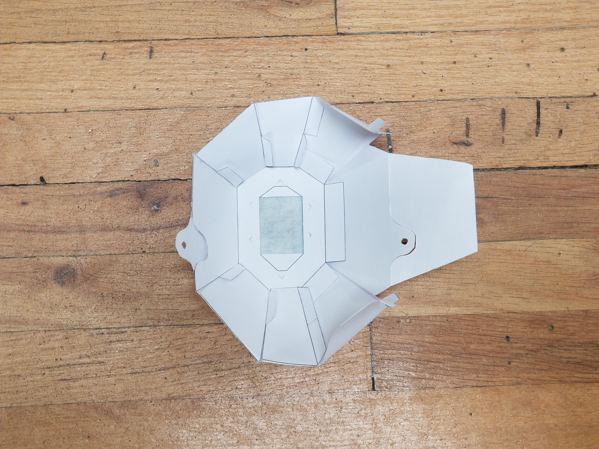

# f8ld The origami filter mask. 
## A simple, cheap and easy to make personal mask with filter. 

## This is the repository for f8ld the origami filter mask.
f8ld is a simple personal mask that can be folded from a single sheet of paper after a contour cut. It does not require glue. Fold is thought as a replacement for the simple medical mask and it features a filter. 
## Size and printing
You can print the pdf file on paper or any sheet material you can easily cut and fold. Print it either as a single sheet on an a3 page (like the included PDF template) or as two a4/letter sheets. In the latter case you will need to join the pieces with tape. 
The size of the mask can be controlled by scaling the print. The pdf as provided is for a large size mask. You can test if the mask fits you by measuring the printed page against your face. The central octagon should reach from a bit above your nose tip (<1cm) to a bit below your chin tip.  
## Cut and fold
Cut along the thick lines and score the mountain and valley dashed lines. Pre-fold the paper before starting the assembly. 
The template folder has the cut template and the assembly instructions.
## Filter and fixation to the face
The mask needs a filter that can be made from any filtering material. In the provided images a piece from a medical mask is used.
You will also need to provide a string (preferably elastic) and tie is through the provided loopholes.
The mask (depending on the material used) can be reused with different filters. Once folded it can be unfolded for the filter change.
## This is not a professional mask!
This is not a professional N95 or FFP2/3 mask and it should not be compared to those. This is a personal mask designed to be affordable and easy to make. The f8ld mask has not been tested in a serious testing environment and has been built using only my expertise and common sense. I am not providing any warranty for its use and I cannot be held liable if it doesn't protect you from a disease or from any air contaminant. It is your responsibility to fold it carefully and add proper filtration material. 
## You might need a nose clip.
The material used is flexible. As a result the design will adapt to the features of your face to some extent. The problematic area is the nose area. This will likely require a nose-clip. This is not included in the design. 
## Images of the folding sequence.

## Updates will follow 
This read.md is still a work in progress. Changes and additions are to be expected. 
## Feel free to fork and improve.
